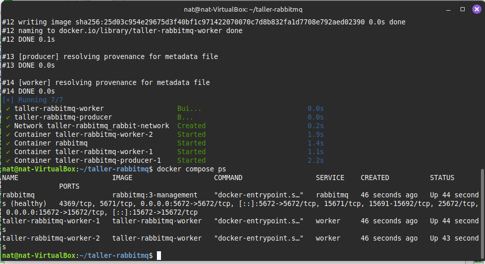
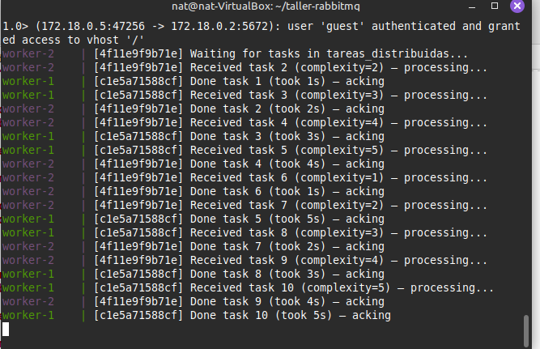
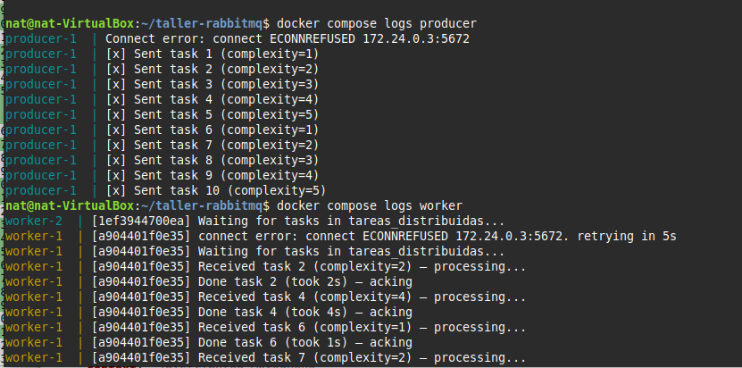
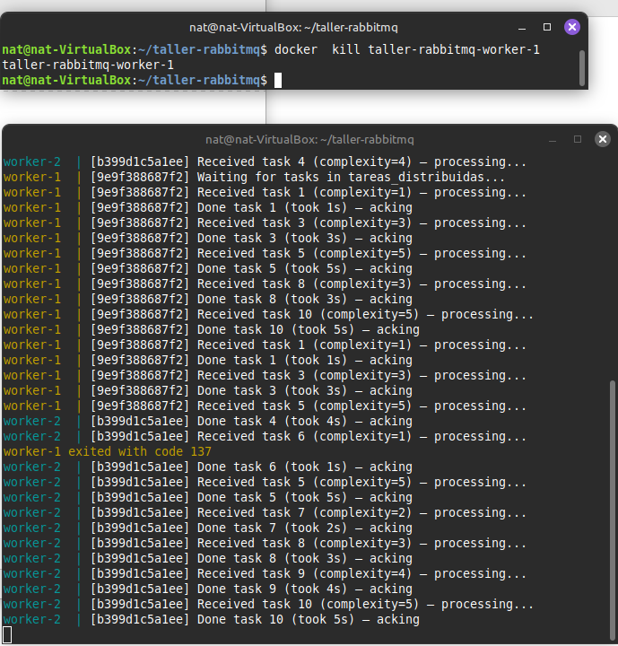

# Taller rabbitmq

## Integrantes:

- Sebastian Cañon
- Natalia Bernal

### Evidencia distribución equilibrada de tareas

Primero se asegura que se ejecuten dos réplicas del worker con el comando:

```bash
docker compose up --build -d --scale worker=2
```

Se verificó que se estén ejecutando dos contenedores:


Con los logs del contenedor se comprueba la distribución de tareas:


Asimismo se pueden ver a continuación los logs del productor y workers:


### Prueba de tolerancia a fallos

Mientras se estaba ejecutando el proyecto se abrió una nueva terminal en la cual se eliminó el contenedor del worker 1, en la segunda consola se evidencia como el worker 2 asume las tareas fatantes de la cola:


### Explicación del flujo del sistema

El sistema implementa un patrón productor–consumidor distribuido utilizando RabbitMQ como message broker.

#### Productor (Producer)

- Genera tareas con un nivel de complejidad de 1 a 5.
- Publica cada tarea en una cola de RabbitMQ llamada `tareas_distribuidas`.

#### Broker (RabbitMQ)

- Actúa como intermediario entre productores y consumidores.
- Almacena temporalmente los mensajes (tareas) y los distribuye a los workers de manera balanceada.
- Garantiza persistencia y acknowledgments: una tarea no se elimina de la cola hasta que un worker confirme su finalización.

#### Consumidores (Workers)

- Reciben los mensajes de la cola `tareas_distribuidas`.
- Al terminar, envían un ACK a RabbitMQ para confirmar que la tarea fue completada exitosamente.

### Explicación de mecanismos de fiabilidad y distribución del trabajo

- Queue(colas) : Las tareas persisten aunque RabbitMQ se reinicie (si está configurado con `durable=true`).

- Los workers confirman las tareas sólo después de procesarlas (`basic_ack`), evitando pérdida de trabajo si un worker falla.

- Si un worker muere (ej. por falta de memoria o caída de contenedor) antes de hacer ACK, RabbitMQ reencola la tarea y otro worker la procesa.

- RabbitMQ asigna las tareas de manera equitativa entre los workers activos y se pueden añadir más workers al sistema sin modificar el productor ni RabbitMQ.
